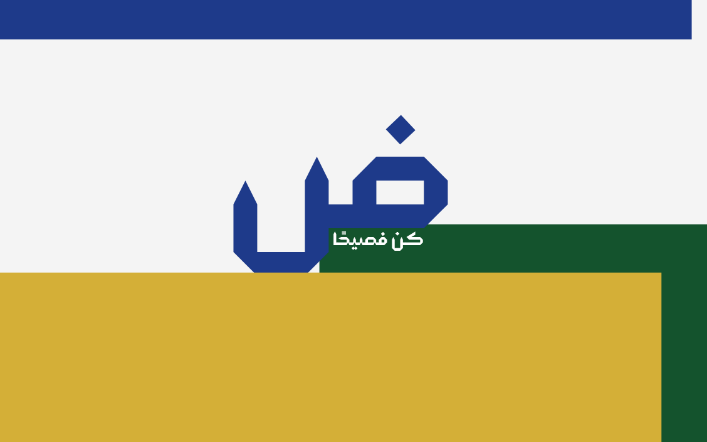

<p align="center">
  <a href="https://github.com/portAmmar/daad-dashboard" target="_blank">
    
  </a>
</p>


# ضاد – لوحة تحكّم عربية لإطار لارافيل  

## مقدّمة  
مشروع **ضاد** هو لوحة تحكّم عربية صُمِّمت خصيصًا لإطار العمل **Laravel**.  
يجمع هذا العمل بين بساطة البناء وقوّة التأسيس، ليقدّم للمطوّر العربي نقطة انطلاق متينة تحمل روح الفصاحة ورونق البيان.  
كما نسج الشعراء قصائدهم على أوزانٍ راسخة، تأتي **ضاد** لتُقيم بنيان التطبيقات على دعائم ثابتة، عربية الوجه واللسان.  

---

## الأهداف  
- **إرساء أساسٍ صلب**: توفير لوحة تحكّم جاهزة بلغة الضاد لتكون مدخلًا لأي مشروع جديد.  
- **التعريب الشامل**: دعم كامل لاتجاه الكتابة من اليمين إلى اليسار (RTL)، مع واجهات عربية صافية.  
- **جمال وبساطة**: اعتماد تصميم أنيق مبني على TailwindCSS، يقدّم تجربة استخدام سلسة.  
- **مرونة وتوسّع**: هيكلية واضحة تسمح بإضافة الوحدات والوظائف بلا تعقيد.  
- **روح عربية**: الحفاظ على هوية لغوية وثقافية في تفاصيل التصميم والنصوص.  

---

## المزايا الرئيسة  
- نظام تسجيل دخول وتسجيل مستخدمين جاهز (بواسطة **Laravel Breeze**).  
- قوالب **Blade** أنيقة مدعومة بـ **Alpine.js** لإضفاء التفاعلية.  
- دعم كامل للغة العربية واتجاه الكتابة RTL.  
- مكوّنات أساسية للوحة التحكّم (شريط جانبي – ترويسة – صفحات رئيسة).  
- بنية نظيفة قابلة للتخصيص والتطوير.  

---

## الهيكلية التقنية  
- **الإطار:** Laravel 11  
- **الواجهات:** Blade + TailwindCSS + Alpine.js  
- **الاعتماديات:** Laravel Breeze للمصادقة والتهيئة الأساسية  
- **الاختبارات:** PestPHP (وحدات + وظائف أساسية)  

---

## خطوات التشغيل  
1. استنسخ المستودع  
   ```bash
   git clone https://github.com/your-username/daad-dashboard.git
   cd daad-dashboard
